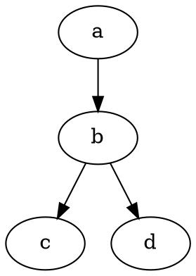
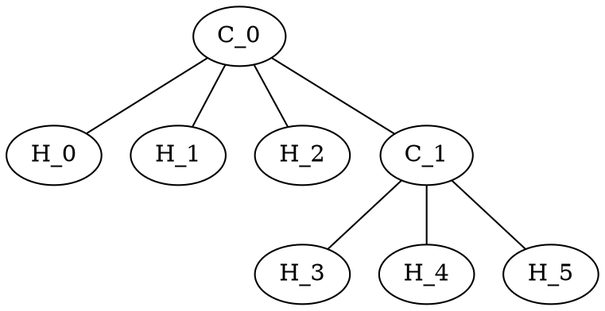

${toc}

# Building

To build this project, install Node.js 13 or greater and run `npm install --ignore-scripts`.
Other versions are not supported but may work if `NODE_OPTIONS=--experimental-modules` environment variable is set.

# Introduction

Markdown on steroids (i.e. lots of server-side compile-time Node.js dependencies).

```math
f(x) = x^2
```

It's beautiful!

```math
bb`E`[X] = int_(-oo)^oo x f(x)  dx
```

We don't need no education.

```math
[λ_0, λ_1, ...;]
[p_(0 0), p_(0 1), ...
 p_(1 0), p_(1 1), ...
 vdots, vdots, ddots]
```

## Function Plots

Rendering plots from Markdown is not a :rocket: science!

```function-plot
width: 320
height: 200
data:
- fn: 'x^2'
xAxis:
  label: 'x - axis'
  domain: [-6, 6]
yAxis:
  label: 'y - axis'
```

## Graphs

Graphs can be specified in DOT graph description language. The library used internally supports other popular formats, but the priority for now is graph layout.



Note that currently manual layout/positioning and attributes are not supported. Hence the support is *experimental*.



## Highlighting

Comes with the bleeding-edge technology for language-independent distraction-free syntax highlighting.

```go
package main

import "fmt"

// fib returns a function that returns
// successive Fibonacci numbers.
func fib() func() int {
	a, b := 0, 1
	return func() int {
		a, b = b, a+b
		return a
	}
}

func main() {
	f := fib()
	// Function calls are evaluated left-to-right.
	fmt.Println(f(), f(), f(), f(), f())
}
```

## Railroad

Another killer feature is the support for syntax diagrams (also known as railroad diagrams).

__Supported notations__

- [PEG.js](https://pegjs.org/)
- [EBNF](https://www.w3.org/TR/2004/REC-xml11-20040204/#sec-notation)
- [Ohm](https://github.com/harc/ohm)

```ohm
Bash {
  Script
      = (Shebang)? allwhitespace* CmdSequence? semicolon*
  CmdSequence = NonemptyListOf<Cmd, semicolon>
  Shebang = "#!" (~"sh" any)* "sh\n"

  Cmd = FunctionDecl
      | CodeBlock
      | IfCommand
      | comment
      | ForCommand
      | WhileCommand
      | CmdWithComment
      | PipeCmd
      | Export
      | Assignment
      | SimpleCmd
      | CaseCommand
      | ("" ~keyword)

  IfCommand
      = IfCase ElseIfThen* ElseCase? EndIf

  IfCase
      = "if" #(allwhitespace+) Conditional semicolon "then" #(allwhitespace+) CmdSequence
  ElseIfThen
      = semicolon "elif" #(allwhitespace+) Conditional semicolon "then" #(allwhitespace+) CmdSequence
  ElseCase
      = semicolon "else" #(allwhitespace+) CmdSequence
  EndIf = semicolon "fi"

  Conditional
      = TestCmd   -- test
      | SimpleCmd -- cmd

  ForCommand
      = "for" "((" ControlStruct "))" semicolon "do" #(allwhitespace+) CmdSequence Done
          -- c_style
      | "for" id "in" (Call | arrayReference) semicolon "do" #(allwhitespace+) CmdSequence Done          -- for_each

  ControlStruct
      = Assignment ";" id BinaryOp Bashword ";" (~")" Bashword)

  WhileCommand
      = "while" #(allwhitespace+) Conditional semicolon "do" #(allwhitespace+) CmdSequence Done

  Done = semicolon "done"

  FunctionDecl
      = ("function" #(space+))? id_std "()"  allwhitespace* CodeBlock // "foo()"
      | "function"  #(space+)   id_std "()"? allwhitespace* CodeBlock // "function foo"

  CodeBlock
      = "{" allwhitespace* CmdSequence allwhitespace* "}"

  CaseCommand
      = "case" Bashword "in" #(allwhitespace+) NonemptyListOf<CaseCase, #(allwhitespace+)> #(allwhitespace+) "esac"

  CaseCase
      = NonemptyListOf<Bashword, "|"> ")" #(allwhitespace*) ListOf<Cmd, (~";;" semicolon)> #(allwhitespace*) (";;" | ";&") comment?

  BinaryOp (Binary infix operator)
      = "=="  | "=" | "-eq"
      | "!="  | "-ne"
      | "-lt" | "\\<"
      | "-gt" | "\\>"
      | "-le"
      | "-ge"

  UnaryOp (Unary operator)
      = "-z" | "-n" | "-b" | "-c" | "-d" | "-e" | "-f" | "-L" | "-p" | "-S"

  SequenceCmd
      = Cmd semicolon Cmd -- std
      | Cmd semicolon -- null

  PipeCmd = (PipeCmd | SimpleCmd) "|" allwhitespace* (PipeCmd | SimpleCmd)

  CmdWithComment
      = SimpleCmd comment

  SimpleCmd
      = SimpleCmdBase Redirect* "&"?

  Redirect
      = ">" Bashword
      | ">>" Bashword

  SimpleCmdBase
      = TestCmd
      | CmdName Bashword* -- std

  TestCmd
      = "test " TestInsides                 -- cmd
      | #("[[" space+) TestInsides "]]"     -- doubleBracket
      | #("[" space+) TestInsides "]"       -- singleBracket

  TestInsides
      = "!"? UnaryOp Bashword               -- unary
      | "!"? Bashword BinaryOp Bashword     -- binary
      | "!"? Bashword                       -- str

  CmdName = (~keyword Bashword #(~alnum))
  comment = space* "#" (~"\n" any)*
  /* modOptions = ("-" |"+" ) letter+ */

  Bashword
      = Call
      | ArrayLiteral
      | arrayLength
      | arrayReference
      | number
      | bareWord

  ArrayLiteral
      = "(" allwhitespace* (Bashword allwhitespace*)* ")"

  Call
      = "$(" Cmd ")"
      | "\"$(" Cmd ")\""
      | "`" Cmd "`"
      | "\"`" Cmd "`\""

  arrayReference
      = "${" id "[@]}"
      | "\"${" id "[@]}\""

  arrayLength
      = "${#" id "[@]}"

  reference
      = "$" id -- simple
      | "${" id "}" -- wrapped
      | "${" id ":" digit+ ":"? digit* "}" -- substr
      | "${" id ("//" | "/") alnum* "/"? alnum* "}" -- substit
      | "${#" id "}" -- length

  number
      = "-"? digit+

  bareWord
      = barewordChar+

  barewordChar
      = stringLiteral -- str
      | (~(badchars | "\\") (reference | any)) -- normal
      | "\\" any -- escape

  keyword
      = keywordRoot ~alnum

  keywordRoot
      = "case" | "esac" | "if" | "then" | "else" | "elif" | "fi" | "for" | "done" | "do" | "function"

  stringLiteral
      = singleString
      | doubleString

  singleString = "'" notSingleQuote* "'"
  doubleString = "\"" notDoubleQuote* "\""

  notSingleQuote
      = (~"'" any)
      | "\\" any -- escape

  notDoubleQuote
      = (~("\"" | "\\") (reference | any))
      | "\\" any -- escape

  badchars = allwhitespace | "|" | ";" | ">" | "#" | "'" | "\"" | "`" | "(" | ")" | "&" | "{" | "}"
  Export
      = "export " Assignment -- assign
      | "export " id -- bare
  Assignment
      = ("local " | "readonly ")? #(id_std "=" ~space) Bashword?

  id  = (~keyword (letter | "_") (alnum | "_")*) -- std
      | digit+ -- arg
      | "?" -- error
      | "#" -- argLength
  space := " " | "\t"
  allwhitespace = space | "\n"
  semicolon
      = ";"* "\n" -- both
      | ";"+
}
```
