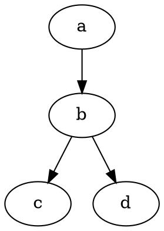
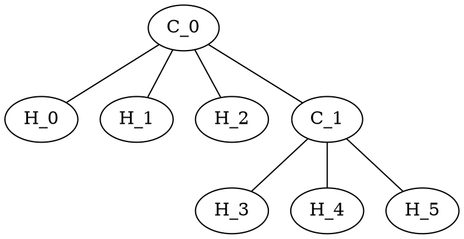

${toc}

# Building

To build this project, install Node.js 13 or greater and run `npm install --ignore-scripts`.
Other versions are not supported but may work if `NODE_OPTIONS=--experimental-modules` environment variable is set.

# Introduction

Markdown on steroids (i.e. lots of server-side compile-time Node.js dependencies).

```math
f(x) = x^2
```

It's beautiful!

```math
bb`E`[X] = int_(-oo)^oo x f(x)  dx
```

We don't need no education.

```math
[λ_0, λ_1, ...;]
[p_(0 0), p_(0 1), ...
 p_(1 0), p_(1 1), ...
 vdots, vdots, ddots]
```

## Function Plots

Rendering plots from Markdown is not a :rocket: science!

```function-plot
width: 320
height: 200
data:
- fn: 'x^2'
xAxis:
  label: 'x - axis'
  domain: [-6, 6]
yAxis:
  label: 'y - axis'
```

## Graphs

Graphs can be specified in DOT graph description language. The library used internally supports other popular formats, but the priority for now is graph layout.



Note that currently manual layout/positioning and attributes are not supported. Hence the support is *experimental*.



## Highlighting

Comes with the bleeding-edge technology for language-independent distraction-free syntax highlighting.

```go
package main

import "fmt"

// fib returns a function that returns
// successive Fibonacci numbers.
func fib() func() int {
	a, b := 0, 1
	return func() int {
		a, b = b, a+b
		return a
	}
}

func main() {
	f := fib()
	// Function calls are evaluated left-to-right.
	fmt.Println(f(), f(), f(), f(), f())
}
```

## Railroad

Another killer feature is the support for syntax diagrams (also known as railroad diagrams).

__Supported notations__

- [PEG.js](https://pegjs.org/)
- [EBNF](https://www.w3.org/TR/2004/REC-xml11-20040204/#sec-notation)
- [Ohm](https://github.com/harc/ohm)

```ebnf
Expression ::= Term ( ( "+" | "-" ) Term )*
Term       ::= Factor ( ( "*" | "/" ) Factor )*
Factor     ::= Constant | Variable | "(" Expression ")"
Variable   ::= "x" | "y" | "z"
Constant   ::= [0-9]+
```
