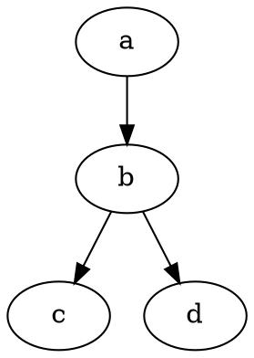
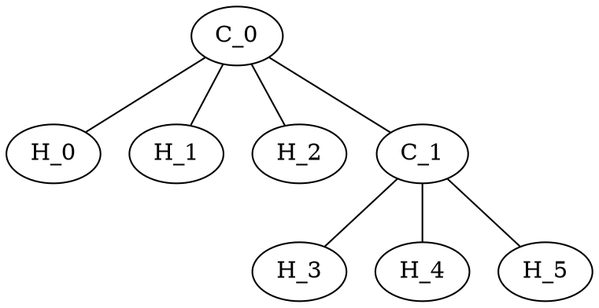

${toc}

# Usage

This project requires Node.js 13 or greater. Node.js 12 is known to work if `NODE_OPTIONS=--experimental-modules` environment variable is set. Other versions are not supported.

Since I don’t have npm registry account and the ecosystem sucks, we have to deal with it.

Create a [new GitHub token](https://github.com/settings/tokens/new) with `read:packages` scope.
Then execute the following commands, replacing `ACCESS_TOKEN` with your token.

```sh
npm set '//npm.pkg.github.com/:_authToken' 'ACCESS_TOKEN'
npm set registry 'https://npm.pkg.github.com/mathdown'
```

[GitHub documentation](https://help.github.com/en/actions/language-and-framework-guides/publishing-nodejs-packages#publishing-packages-to-github-packages) also recommends running `npm set always-auth true`.

If you find colors annoying, run `npm set color false`. This step is optional.

To disable Git commit and tag creating on [version bump](https://docs.npmjs.com/cli/version) run `npm set git-tag-version false`.

Linting the code requires some extra hacks until [eslint/eslint#13196](https://github.com/eslint/eslint/pull/13196) (support for ECMAScript 2020) and [benmosher/eslint-plugin-import](https://github.com/benmosher/eslint-plugin-import/commit/6a110dd16a7fd775f08601054bf14ffd503eea7b) (support for eslint 7) are released. You can use [`setup-eslint.sh`](setup-eslint.sh) script to set up the required versions. Running this script will also install project dependencies.

Otherwise, simply run `npm ci --ignore-scripts`.

Then, to render this file using MathDown, run the command below from the project root and open `README.html` in web browser.

```sh
node bin/mathdown.mjs -input README.md -output README.html -metadata assets/metadata.yaml -template assets/template.htm
```

# Introduction

Markdown on steroids (i.e. lots of server-side compile-time Node.js dependencies).

## MathML

MathDown renders [mathup](https://runarberg.github.io/mathup) markup language as [MathML](https://w3.org/Math).

Firefox and Safari support the standard out of the box, though the latter has some quirks, e.g. when rendering `$f(x)$` expression (nested `<mrow>`). Partial support for [MathML in Chromium](https://mathml.igalia.com) is available in the [latest build](https://download-chromium.appspot.com) and [Chrome Canary](https://tools.google.com/dlpage/chromesxs) with experimental web platform features enabled.

[MathJax](https://mathjax.org) is loaded as a [fallback for browsers without MathML support](https://developer.mozilla.org/en-US/docs/Web/MathML/Authoring#Fallback_for_Browsers_without_MathML_support). You may either force or disable this behavior by appending `?mathjax=force` or `?mathjax=disable` query to the file URL.

```math
bb E [X] = int_(-oo)^oo x f(x)  dx
```

```math
[λ_0, λ_1, ...;]
[p_(0 0), p_(0 1), ...
 p_(1 0), p_(1 1), ...
 vdots, vdots, ddots]
```

## Function Plots

Rendering plots from Markdown is not a :rocket: science!

```math
f(x) = x^2
```

```function-plot
width: 320
height: 200
data:
- fn: 'x^2'
  graphType: 'polyline'
xAxis:
  label: 'x - axis'
  domain: [-6, 6]
yAxis:
  label: 'y - axis'
```

## Graphs

Graphs can be specified in DOT graph description language. The library used internally supports other popular formats, but the priority for now is graph layout.



Note that currently manual layout/positioning and attributes are not supported. Hence the support is *experimental*.



## Highlighting

MathDown performs language-agnostic distraction-free syntax highlighting.

```go
package main

import "fmt"

// fib returns a function that returns
// successive Fibonacci numbers.
func fib() func() int {
	a, b := 0, 1
	return func() int {
		a, b = b, a+b
		return a
	}
}

func main() {
	f := fib()
	// Function calls are evaluated left-to-right.
	fmt.Println(f(), f(), f(), f(), f())
}
```

## Railroad

Another killer feature is the support for syntax diagrams (also known as railroad diagrams).

__Supported notations__

- [PEG.js](https://pegjs.org/)
- [EBNF](https://www.w3.org/TR/2004/REC-xml11-20040204/#sec-notation)
- [Ohm](https://github.com/harc/ohm)

```ebnf
Expression ::= Term ( ( "+" | "-" ) Term )*
Term       ::= Factor ( ( "*" | "/" ) Factor )*
Factor     ::= Constant | Variable | "(" Expression ")"
Variable   ::= "x" | "y" | "z"
Constant   ::= [0-9]+
```
