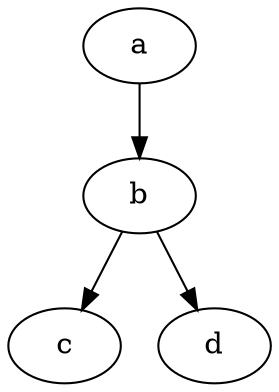
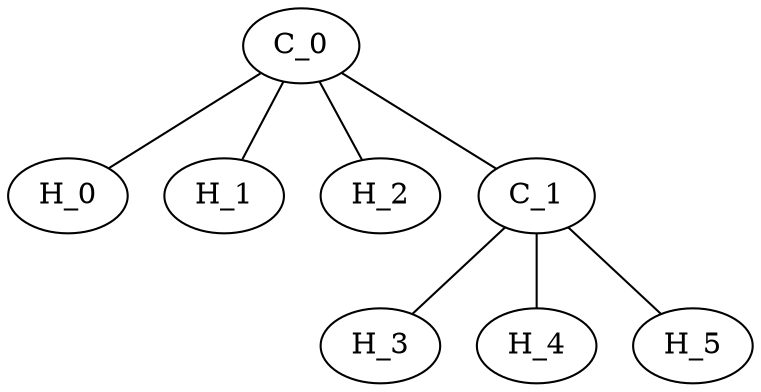

# Viva Graph

# Sample 1

```dot
digraph {
	a -> b -> c
	b -> d
}
```

# Sample 2

```dot
graph ethane {
	C_0 -- H_0 [type=s]
	C_0 -- H_1 [type=s]
	C_0 -- H_2 [type=s]
	C_0 -- C_1 [type=s]
	C_1 -- H_3 [type=s]
	C_1 -- H_4 [type=s]
	C_1 -- H_5 [type=s]
}
```
